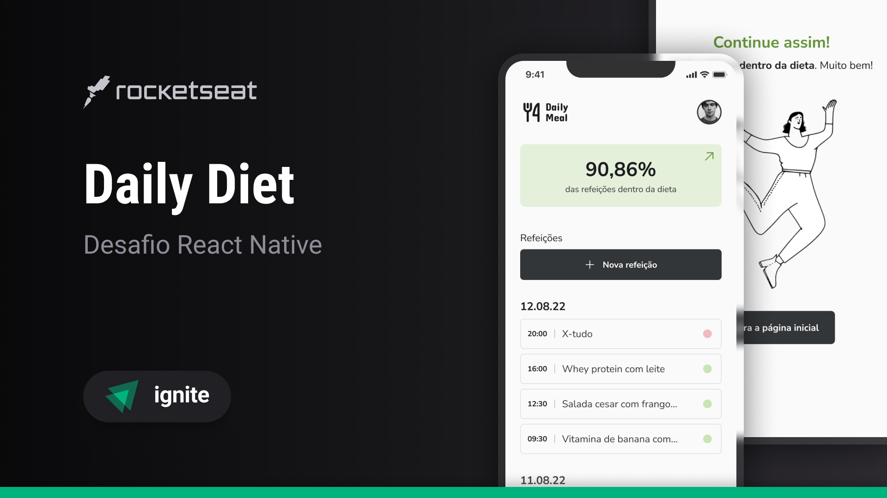

<h1 align='center'>🚧 Ignite Daily Diet Web in progress... 🚧</h1>

<div align='center'>

  
  
  [](https://opensource.org/licenses/MIT)

  [🎨 Mobile Design](https://www.figma.com/design/0507XcCgEpjZwM5UKuFmg5/Daily-Diet-%E2%80%A2-Desafio-React-Native-(Community)?node-id=2-12&t=UiGTDLfY7wSTv3rj-0)

  [🇬🇧 English](#en) / [🇧🇷 Português](#pt-br)

</div>

## <a id='en' style='text-decoration: none; color: inherit;'>🇬🇧 English</a>

### 📚 Summary
- [❕ About](#en-about)
- [📖 Instructions](#en-instructions)
  - [📥 Install](#en-install)
  - [🚀 Run Locally](#en-locally)
  - [📔 Run Storybook](#en-storybook)
- [📂 Structure](#en-structure)

#### <a id='en-about' style='text-decoration: none; color: inherit;'>❕ About</a>
A web implementation of the NodeJs and React Native challenge of Ignite, Rocketseat's programming course, made to use the API created in the NodeJs modeule, where you can handle your diet, by creating, listing, visualizing, editing your diets, besides retrieving metrics of them 

#### <a id='en-instructions' style='text-decoration: none; color: inherit;'>📖 Instructions</a>
##### <a id='en-instalar' style='text-decoration: none; color: inherit;'>📥 Install</a>
Paste this 1º command into a terminal opened within a folder of your preference to clone the project
```sh
git clone https://github.com/mar-alv/ignite-daily-diet-web.git
```

Then run one of the versions of the 2º command to install the dependencies
```sh
pnpm i
```
```sh
pnpm install
```

##### <a id='en-locally' style='text-decoration: none; color: inherit;'>🚀 Run Locally</a>
Paste the command into a terminal, the application will be accessable through this [link](http://localhost:5173)
```sh
pnpm run dev
```

##### <a id='en-storybook' style='text-decoration: none; color: inherit;'>📔 Run Storybook</a>
Paste the command into a terminal, the project's components documentation will be accessible through this [link](http://localhost:6006)
```sh
pnpm run storybook
```

#### <a id='en-structure' style='text-decoration: none; color: inherit;'>📂 Structure</a>
```
│ .storybook/
│   └── ...
│ src/
│   ├── assets/
│   │     └── ...
│   ├── components/
│   │     └── ...
│ 	├──	stories/
│   │			└── ...
│   └── ...
```

## <a id='pt-br' style='text-decoration: none; color: inherit;'>🇧🇷 Português</a>

### 📚 Sumário
- [❕ Sobre](#pt-br-sobre)
- [📖 Instruções](#pt-br-instrucoes)
  - [📥 Instalar](#pt-br-instalar)
  - [🚀 Rodar Localmente](#pt-br-localmente)
  - [📔 Rodar Storybook](#pt-br-storybook)
- [📂 Estrutura](#pt-br-estrutura)

#### <a id='pt-br-sobre' style='text-decoration: none; color: inherit;'>❕ Sobre</a>
Uma implementação web do desafio NodeJs e React Native do Ignite, curso de programação da Rocketseat, feito para usar a API criada no módulo NodeJs, onde você pode gerenciar sua dieta, criando, listando, visualizando e editando suas dietas, além de recuperar métricas delas.

#### <a id='pt-br-instrucoes' style='text-decoration: none; color: inherit;'>📖 Instruções</a>
##### <a id='pt-br-instalar' style='text-decoration: none; color: inherit;'>📥 Instalar</a>
Cole o 1º comando em um terminal aberto dentro da pasta de sua preferência para clonar o projeto
```sh
git clone https://github.com/mar-alv/ignite-daily-diet-web.git
```

Em seguida rode uma das versões do 2º comando para instalar as dependências
```sh
pnpm i
```
```sh
pnpm install
```

##### <a id='pt-br-localmente' style='text-decoration: none; color: inherit;'>🚀 Rodar Localmente</a>
Cole o comando em um terminal, a aplicação estará acessível através desse [link](http://localhost:5173)
```sh
pnpm run dev
```

##### <a id='pt-br-storybook' style='text-decoration: none; color: inherit;'>📔 Rodar Storybook</a>
Cole o comando num terminal, a documentação dos componentes do projeto estará acessível através desse [link](http://localhost:6006)
```sh
pnpm run storybook
```

#### <a id='pt-br-estrutura' style='text-decoration: none; color: inherit;'>📂 Estrutura</a>
```
│ .storybook/
│   └── ...
│ src/
│   ├── assets/
│   │     └── ...
│   ├── components/
│   │     └── ...
│ 	├──	stories/
│   │			└── ...
│   └── ...
```

## 🧰 Technologies
### Build Tools
[](https://vitejs.dev/)

### Documentation
[](https://storybook.js.org/)

### Front-end Framework
[](https://reactjs.org/)
[](https://www.typescriptlang.org/)

### Styling
[](https://phosphoricons.com/)
[](https://tailwindcss.com/)

## Author
<div style='display: flex; align-items: center;'>
    
    <div>
        <strong>Marcelo Alvarez</strong>
        <br>
        <em>Front-end Developer</em><br>
        <span>"Some AI generated funny quote here 😗"</span><br>
        <a href='https://www.linkedin.com/in/marcelo-dos-santos-alvarez-474406180/'>LinkedIn</a> |
        <a href='/'>Portfolio</a>
    </div>
</div>

## License
Licensed under [MIT](./LICENSE)
