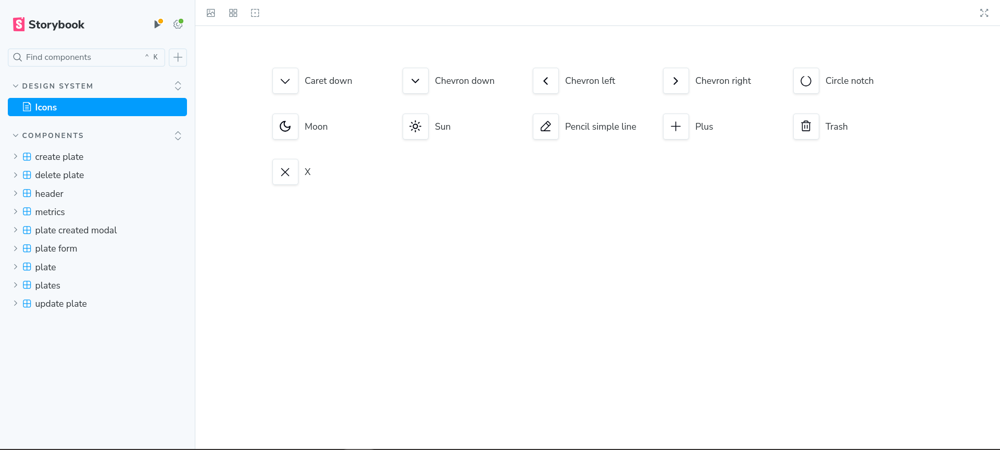
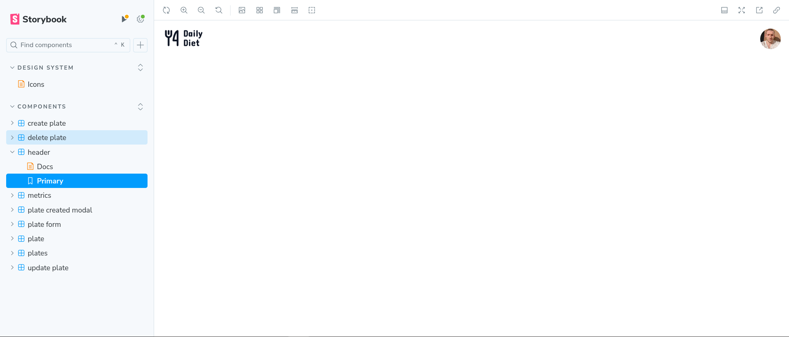
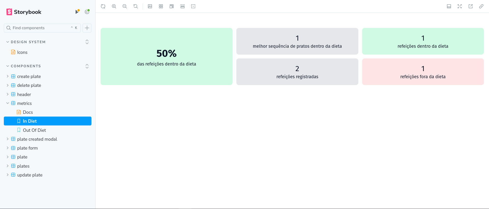
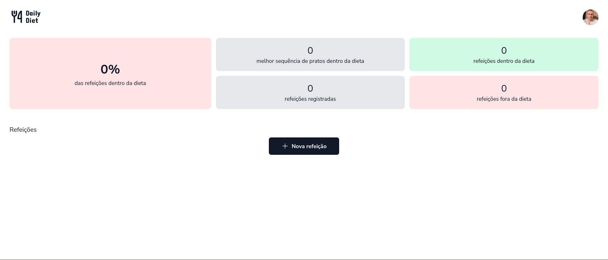

<h1 align='center'>Ignite Daily Diet Web</h1>

<div align='center'>

  
  
  [](https://opensource.org/licenses/MIT)

  [🎨 Mobile Design](https://www.figma.com/design/0507XcCgEpjZwM5UKuFmg5/Daily-Diet-%E2%80%A2-Desafio-React-Native-(Community)?node-id=2-12&t=UiGTDLfY7wSTv3rj-0)

  [🇵🇹 Português](./docs/README-pt.md)

</div>

## 📚 Summary
- [❕ About](#about)
- [📖 Instructions](#instructions)
  - [📥 Install](#install)
  - [🚀 Run Locally](#locally)
  - [📔 Run Storybook](#storybook)
- [📂 Structure](#structure)
- [🧰 Technologies](#technologies)
- [📸 Screenshots and 🎥 Recordings](#screenshots-prints)
- [👤 Author](#author)
- [📄 License](#license)

### <a id='about' style='text-decoration: none; color: inherit;'>❕ About</a>
A web implementation of the NodeJs and React Native challenge of Ignite, Rocketseat's programming course, made to use the API created in the NodeJs modeule, where you can handle your diet, by creating, listing, visualizing, editing your diets, besides retrieving metrics of them 

### <a id='instructions' style='text-decoration: none; color: inherit;'>📖 Instructions</a>
#### <a id='en-instalar' style='text-decoration: none; color: inherit;'>📥 Install</a>
Paste this 1º command into a terminal opened within a folder of your preference to clone the project
```sh
git clone https://github.com/mar-alv/ignite-daily-diet-web.git
```

Then run one of the versions of the 2º command to install the dependencies
```sh
pnpm i
```
```sh
pnpm install
```

#### <a id='locally' style='text-decoration: none; color: inherit;'>🚀 Run Locally</a>
Paste the command into a terminal, the application will be accessable through this [link](http://localhost:5173)
```sh
pnpm run dev
```

#### <a id='e2e-tests' style='text-decoration: none; color: inherit;'>🏁 Run End-To-End Tests</a>
Paste the command into a terminal, the tests will be open in a browser tab automatically, controlling it like an actual user, clicking on buttons, interacting with forms, etc... The results will appear within the own interface
```sh
npm run tests-e2e
```

#### <a id='storybook' style='text-decoration: none; color: inherit;'>📔 Run Storybook</a>
Paste the command into a terminal, the project's components documentation will be accessible through this [link](http://localhost:6006)
```sh
pnpm run storybook
```

### <a id='structure' style='text-decoration: none; color: inherit;'>📂 Structure</a>
```
│ .github/
│   └── ...
│ .storybook/
│   └── ...
│ docs/
│   └── ...
│ public/
│   └── ...
│ src/
│   ├── api/
│   │     ├── mocks/
│   │     │     └── ...
│   │     └── ...
│   ├── assets/
│   │     └── ...
│   ├── components/
│   │     ├── ui/
│   │     │     └── ...
│   │     └── ...
│   ├── interfaces/
│   │     └── ...
│   ├── lib/
│   │     └── ...
│ 	├──	stories/
│   │			└── ...
│   └── ...
│ tests/
│   └── ...
```

## <a id='technologies' style='text-decoration: none; color: inherit;'>🧰 Technologies</a>
### Build Tools
[](https://vitejs.dev/)

### Components
[](https://lucide.dev/)
[](https://phosphoricons.com/)
[](https://radix-ui.com/)
[](https://www.npmjs.com/package/react-loading-skeleton)
[](https://ui.shadcn.com)
[](https://fkhadra.github.io/react-toastify/introduction)

### Documentation
[](https://storybook.js.org/)

### Front-end Framework
[](https://reactjs.org/)
[](https://tanstack.com/query/v3)
[](https://www.typescriptlang.org/)

### Styling
[](https://postcss.org/)
[](https://tailwindcss.com/)

### Testing
[](https://playwright.dev/)
[](https://vitest.dev/)
[](https://mswjs.io/)

### Utilities
[](https://date-fns.org/)
[](https://react-day-picker.js.org/)
[](https://react-hook-form.com/)
[](https://zod.dev/)

## <a id='screenshots-prints' style='text-decoration: none; color: inherit;'>📸 Screenshots and 🎥 Recordings</a>
<div align='center'>

  

Colors stories

</div>

<div align='center'>

  

Icons stories

</div>

<div align='center'>

  

Header stories

</div>

<div align='center'>

  

  Positive metrics stories

</div>

<div align='center'>

  

  Negative metrics stories

</div>

<div align='center'>

  

  Creating plate stories

</div>

<div align='center'>

  

  Deleting plate stories

</div>


<div align='center'>

  

  Other stories

</div>

<div align='center'>

  

  No plates

</div>

## <a id='author' style='text-decoration: none; color: inherit;'>👤 Author</a>
<div style='display: flex; align-items: center;'>
    
    <div>
        <strong>Marcelo Alvarez</strong>
        <br>
        <em>Front-end Developer</em><br>
        <span>"Some AI generated funny quote here 😗"</span><br>
				<a href='https://www.linkedin.com/in/mar-alv'>
  				
				</a>
				<a href='https://mar-alv.github.io/'>
  				
				</a>
    </div>
</div>

## <a id='license' style='text-decoration: none; color: inherit;'>📄 License</a>
Licensed under [MIT](./LICENSE)
