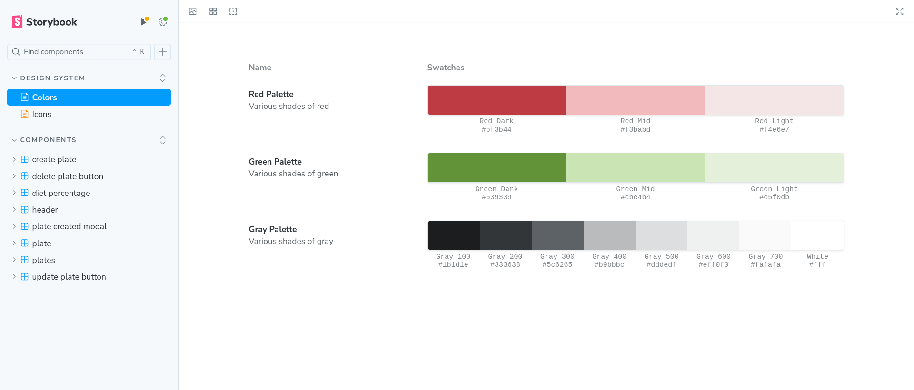
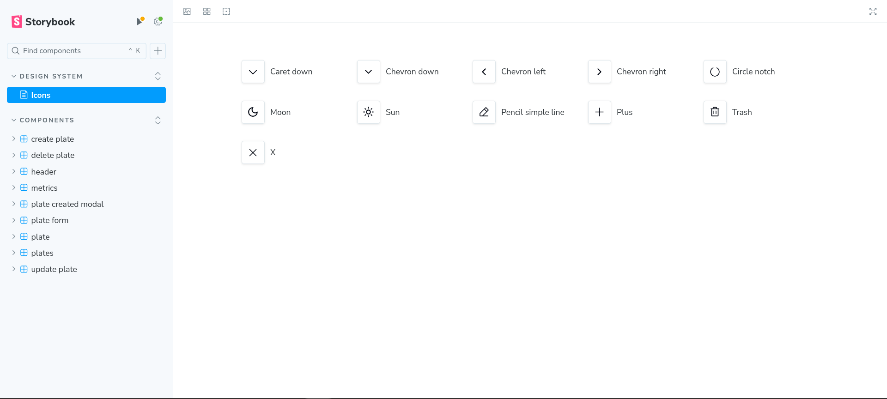
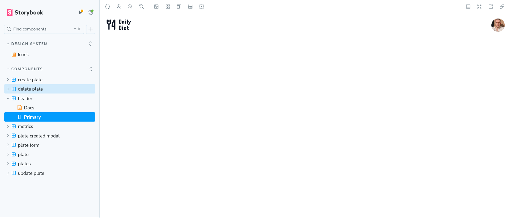
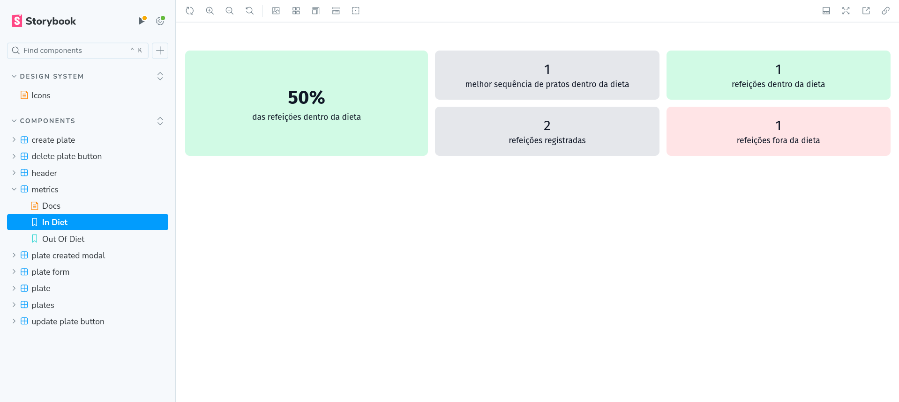
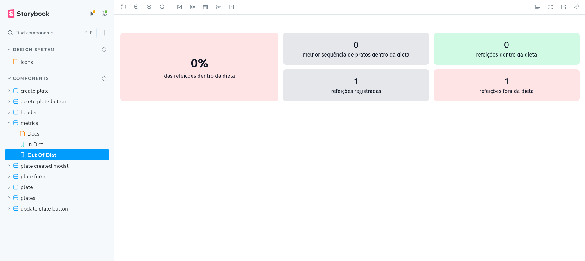
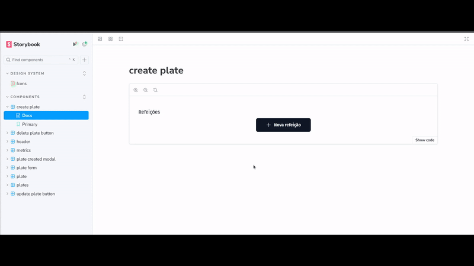
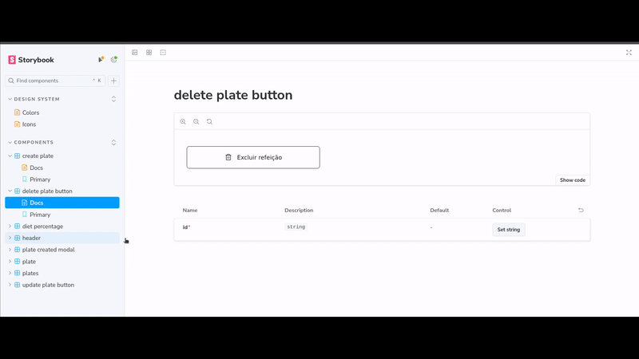
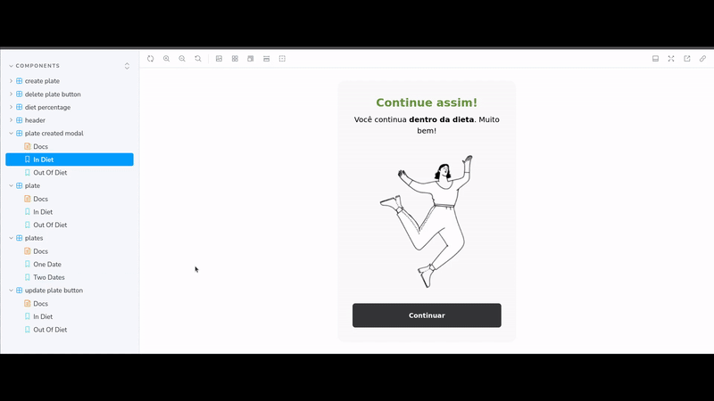
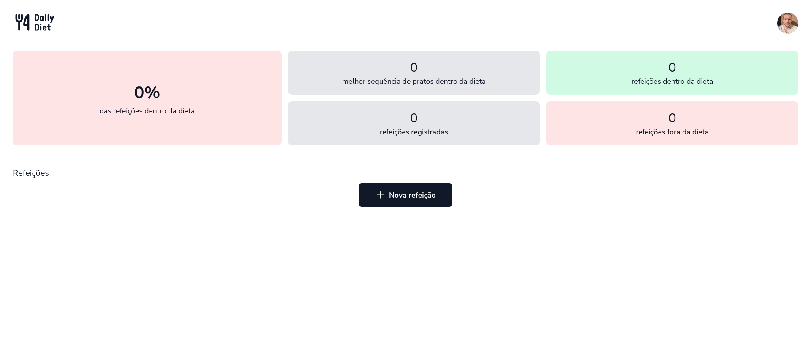

<h1 align='center'>Ignite Daily Diet Web</h1>

<div align='center'>

  
  
  [](https://opensource.org/licenses/MIT)

  [🎨 Mobile Design](https://www.figma.com/design/0507XcCgEpjZwM5UKuFmg5/Daily-Diet-%E2%80%A2-Desafio-React-Native-(Community)?node-id=2-12&t=UiGTDLfY7wSTv3rj-0)

  [⬅️ Voltar](../README.md)

</div>

## 📚 Sumário
- [❕ Sobre](#about)
- [📖 Instruções](#instructions)
  - [📥 Instalar](#install)
  - [🚀 Rodar Localmente](#locally)
  - [📔 Rodar Storybook](#storybook)
- [📂 Estrutura](#structure)
- [🧰 Tecnologias](#technologies)
- [📸 Prints e 🎥 Gravações](#screenshots-prints)
- [👤 Autor](#author)
- [📄 Licença](#license)

### <a id='about' style='text-decoration: none; color: inherit;'>❕ Sobre</a>
Uma implementação web do desafio NodeJs e React Native do Ignite, curso de programação da Rocketseat, feito para usar a API criada no módulo NodeJs, onde você pode gerenciar sua dieta, criando, listando, visualizando e editando suas dietas, além de recuperar métricas delas.

### <a id='instructions' style='text-decoration: none; color: inherit;'>📖 Instruções</a>
#### <a id='install' style='text-decoration: none; color: inherit;'>📥 Instalar</a>
Cole o 1º comando em um terminal aberto dentro da pasta de sua preferência para clonar o projeto
```sh
git clone https://github.com/mar-alv/ignite-daily-diet-web.git
```

Em seguida rode uma das versões do 2º comando para instalar as dependências
```sh
pnpm i
```
```sh
pnpm install
```

#### <a id='locally' style='text-decoration: none; color: inherit;'>🚀 Rodar Localmente</a>
Cole o comando em um terminal, a aplicação estará acessível através desse [link](http://localhost:5173)
```sh
pnpm run dev
```

##### <a id='e2e-tests' style='text-decoration: none; color: inherit;'>🏁 Rodar Testes End-To-End</a>
Cole o comando num terminal, os testes serão abertos numa aba do navegador automaticamente, controlando ela como um usuário real, clicando em botões, interagindo com formulários, etc... Os resultados aparecerão na própria interface
```sh
npm run tests-e2e
```

#### <a id='storybook' style='text-decoration: none; color: inherit;'>📔 Rodar Storybook</a>
Cole o comando num terminal, a documentação dos componentes do projeto estará acessível através desse [link](http://localhost:6006)
```sh
pnpm run storybook
```

### <a id='structure' style='text-decoration: none; color: inherit;'>📂 Estrutura</a>
```
│ .github/
│   └── ...
│ .storybook/
│   └── ...
│ docs/
│   └── ...
│ public/
│   └── ...
│ src/
│   ├── api/
│   │     ├── mocks/
│   │     │     └── ...
│   │     └── ...
│   ├── assets/
│   │     └── ...
│   ├── components/
│   │     ├── ui/
│   │     │     └── ...
│   │     └── ...
│   ├── interfaces/
│   │     └── ...
│   ├── lib/
│   │     └── ...
│ 	├──	stories/
│   │			└── ...
│   └── ...
│ tests/
│   └── ...
```

## <a id='technologies' style='text-decoration: none; color: inherit;'>🧰 Tecnologias</a>
### Build Tools
[](https://vitejs.dev/)

### Components
[](https://lucide.dev/)
[](https://phosphoricons.com/)
[](https://radix-ui.com/)
[](https://www.npmjs.com/package/react-loading-skeleton)
[](https://ui.shadcn.com)
[](https://fkhadra.github.io/react-toastify/introduction)

### Documentation
[](https://storybook.js.org/)

### Front-end Framework
[](https://reactjs.org/)
[](https://tanstack.com/query/v3)
[](https://www.typescriptlang.org/)

### Styling
[](https://postcss.org/)
[](https://tailwindcss.com/)

### Testing
[](https://playwright.dev/)
[](https://vitest.dev/)
[](https://mswjs.io/)

### Utilities
[](https://date-fns.org/)
[](https://react-day-picker.js.org/)
[](https://react-hook-form.com/)
[](https://zod.dev/)

## <a id='screenshots-prints' style='text-decoration: none; color: inherit;'>📸 Prints e 🎥 Gravações</a>
<div align='center'>

  

  Stories das cores

</div>

<div align='center'>

  

  Stories dos ícones

</div>

<div align='center'>

  

  Stories do cabeçalho

</div>

<div align='center'>

  

  Stories das métricas positivas

</div>

<div align='center'>

  

  Stories das métricas negativas

</div>

<div align='center'>

  

  Stories da criação de refeições

</div>

<div align='center'>

  

  Stories da remoção de refeições

</div>


<div align='center'>

  

  Outros stories

</div>

<div align='center'>

  

  Sem refeições criadas

</div>

## <a id='author' style='text-decoration: none; color: inherit;'>👤 Autor</a>
<div style='display: flex; align-items: center;'>
		
		<div>
				<strong>Marcelo Alvarez</strong>
				<br>
				<em>Front-end Developer</em><br>
				<span>"Uma citação engraçada gerada por IA aqui 😗"</span><br>
				<a href='https://www.linkedin.com/in/mar-alv'>
					
				</a>
				<a href='https://mar-alv.github.io/'>
					
				</a>
		</div>
</div>

## <a id='license' style='text-decoration: none; color: inherit;'>📄 Licença</a>
Licenciado via [MIT](./LICENSE)
